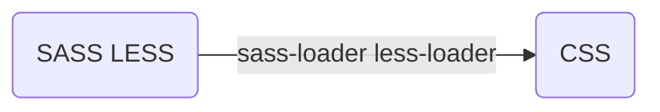
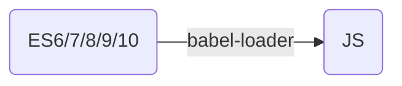
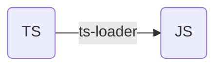
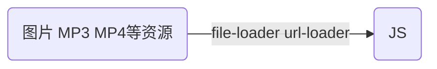

## 1.初始化项目

### 1.1 创建项目并初始化`package.json`

```
npm init -y
```

### 1.2 安装 webpack 和 webpack-cli

```
npm i webpack webpack-cli -D
```

### 1.3 在根目录下创建默认的 webpack 配置入口文件`webpack.config.js`

该文件在执行 webpack 打包构建项目时会被读取里边的配置，所有的 loader、plugin 以及其他都在这里配置。若要修改默认配置文件的入口，可执行以下指令

```bash
webpack --config webpack.dev.config.js
// webpack.config.js ==> webpack.dev.config.js
```

### 1.4 在`package.json`文件中配置 webpack 命令脚本

```json
"scripts":{
  "build": "webpack --config webpack.config.js"
}
```

在命令行执行如下命令，即可打包构建当前项目

```bash
npm run build
```

## 2.Webpack 配置入口和出口

在`webpack.config.js`文件中

- `entry`字段对应入口文件
- `output.path`字段对应出口文件所在目录路径
- `output.filename`字段对应出口文件名

```js
// webpack.config.js
let path = require('path')

let config = {
	entry: './src/main.js', // 入口文件
	output: {
		// 出口
		path: path.resolve(__dirname, 'dist'),
		filename: 'bundle.js',
	},
}

module.exports = config
```

在根目录下执行以下指令，会将`src/main.js`作为入口文件开始编译打包输出为`dist`目录下的`bundle.js`文件

```bash
webpack
// 或者
npm run build
```

或者不用在`webpack.config.js`中配置`entry`和`output`，在`package.json`文件中定义脚本(不推荐)

```json
"scripts":{
  "build": "webpack --entry ./src --output-path ./dist"
}
```

<br/>

## 3.Loader

Loader 用于`预编译`及其`处理依赖关系`，通常是在`webpack.config.js`文件中的`module.rules`字段配置









通过 loader 还可以将所有类型文件都统一转化成`模块`，即 `“万物皆模块”`的前端工程化思想，从而可以根据`ESModule`或者`CommonJS`模块化规范引入任何类型的文件

```js
// 1.ESModule规范
export { xx } // 导出
import xx from 'xx.js' // 导入
import 'yy.css' // 导出yy.css里的代码，前提需要css-loader处理

// 2.CommonJS规范
module.exports = { xx } // 导出
let xx = require('xx.png') // 导入
```

### 3.1 css 相关 loader

#### 3.1.1 css-loader

用于编译 css 文件，使其可以作为一个模块以`import 'xx.css'`的方式引入，首先需要安装`css-loader`

```
npm i css-loader -D
```

在`webpack.config.json`文件中`module.rules`中配置对应的 loader

```js
module: {
	// 模块
	rules: [
		// 打包规则
		{
			test: /\.css$/, // 正则匹配到的以.css结尾的文件
			use: ['css-loader'], // 用css-loader预编译

			// use其他写法
			// use:[
			//   { loader:'css-loader'} // 'css-loader'是{loader:'css-loader'}简写
			// ]

			// loader:'css-loader' 若只有一个loader那么不用use
		},
	]
}
```

#### 3.1.2 style-loader

` style-loader`用于将编译好的 css 文件以 style 标签的方式插入 html 文件中

安装

```
npm i style-loader -D
```

配置

```js
module: {
	rules: [
		{
			test: /\.css$/,
			use: ['style-loader', 'css-loader'],
			// 注意数组项的顺序,这里会先css-loader处理后再交给style-loader处理,
			// 这样css样式才会最终应用于html文件
		},
	]
}
```

#### 3.1.3 less-loader 和 sass-loader

`less-loader`和`sass-loader`用于将 less、sass 文件编译成 css 文件

安装

```
npm i less-loader less sass-loader -D
```

补充：less 插件可以将指定 less 文件转译为 css 文件，指令如下

```bash
npm less ./style/index.less ./style/index.css
```

但是这样是通过命令行手动一个一个编译的，不方便，故需要安装 less-loader，通过 webpack 配置，让 less-loader 自动调用 less 插件实现自动编译

配置

```js
module: {
	rules: [
		{
			test: /\.less$/,
			use: ['style-loader', 'css-loader', 'less-loader'], // less --> css --> 插入style标签
		},
		{
			test: /\.(scss|sass)$/,
			use: ['style-loader', 'css-loader', 'sass-loader'],
		},
	]
}
```

### 3.2 JS 相关 loader

#### 3.2.1 ☆babel

`babel`可以将`jsx`、`ts`、`es6+`、`vue`等转译为浏览器能够识别的`js`，并做兼容处理（根据配置的 browserslist 条件）

##### babel-loader

`babel-loader`是一个非常非常非常重要的编译 JS 的插件，其中`@babel/preset-env`提供了全套的预置功能用以增强 babel-loader 例如：

- `@babel/plugin-transform-arrow-functions`（转译箭头函数）
- `@babel/plugin-transform-block-function`(转译 const、let 语法)

安装

```
npm i babel-loader @babel/core @babel/preset-env -D
```

配置

```js
module: {
  rules: [
    {
      test:/\.js$/,
      use:[
        loader:'babel-loader',
        options:{
          presets:['@babel/preset-env']
         // plugins:[
         //  '@babel/plugin-transform-arrow-functions',
         //  '@babel/plugin-transform-block-function',
         // ]
        }
      ],
      exclude:/node_modules/ // 排除node_modules目录
    }
  ]
}
```

##### polyfill

`polyfill`是用于做兼容的 JS 代码填充插件，会根据 js 源码以及 broserslist 条件填充相应的代码，是作为`@bable/preset-env`的一个补丁。

例如源码中使用到`Promise`这个来自 ES6 的新玩意，而某些浏览器不会识别 Promise 这个对象，polyfill 会在打包构建项目时填充 Promise 的实现代码

安装

```
npm i core-js regenerator-runtime -D
```

`core-js/stable`用于填充符合 ES 标准的新语法特性，`regenerator-runtime`用于编译 ES6 后新添加的`Generator函数`

将 babel 插件从 webpack 配置中独立出来，在根目录下创建`babel.config.js`

```js
module.exports = {
	presets: [
		[
			'@babel/preset-env',
			{
				useBuiltIns: 'usage',
				// 默认为false，即不对js做填充处理
				// usage，根据兼容浏览器及JS源码，按需填充(推荐)
				// entry，根据兼容浏览器全填充，
				// 坑：若为entry需要在入口js文件开头导入core-js/stable和regenerator-runtime/runtime
				corejs: 3, // 坑必须指定corejs版本
			},
		],
	],
}
```

或者在根目录下创建`.babelrc`文件

```json
{
	"presets": ["@babel/preset-env", { "useBuildIns": "usage", "corejs": 3 }]
}
```

#### 3.2.2 vue-loader

vue-loader@15 版本之前，配置

```js
{
  test:/\.vue$/,
  use:['vue-loader']
}
```

vue-loader@15 版本后，需要加入 plugin

```js
let VueLoaderPlugin = require('vue-loader/lib/plugin')

plugins: [new VueLoaderPlugin()]
```

#### 3.2.3 ts-loader

`ts-loader`可以编译 ts 文件，但是推荐统一使用`babel-loader`，在`.babelrc`中配置`@babel/preset-typescript`即可

安装

```
npm i @babel/preset-typescript
```

配置

```
{
  presets:[
    [
      '@babel/preset-env',
      {
        useBuildIns:'usage',
        corejs:3
      }
   ],
   [ '@babel/preset-typescript' ]
  ]
}
```

### 3.3 兼容处理

#### 3.3.1 browserslist 浏览器兼容

在根目录下创建`.browserslistrc`文件，使得项目构建时能够根据设置的条件做浏览器兼容处理

例如：配置了预设`babel-preset-env`的`babel-loader`、配置了预设`postcss-preset-env`的`postcss-loader`，会根据`.broswerslistrc`文件中的条件做兼容编译

配置

```js
> 1%   // 市场使用度超过1%的浏览器版本
last 2 version   // 该浏览器最新的两个版本
not dead   // 还未淘汰(两年之内有过更新)
```

推荐在`package.json`文件中配置`browserslist`字段，无需创建`.browserslistrc`文件

```json
"browserslist":[
    ">1%",
    "last 2 versions",
    "not dead"
]
```

补充：webpack 包下内置 browserslist 包，执行以下命令会输出打印要兼容的浏览器版本列表

```
npm browserslist
```

#### 3.3.2 postcss 样式兼容

`postcss`是利用 js 转换 css 样式的工具，根据配置的`browserslist`条件自动补充 css 属性前缀

安装

- `postcss`包
- `autoprefixer`自动补充前缀插件（扩展 postcss-loader 功能的插件）
- `postcss-loader`
- `postcss-preset-env`（postcss-loader 配置预设集）

```bash
npm i postcss postcss-loader postcss-preset-env autoprefixer -D
```

配置

```js
{
  test: /\.css$/,
  use: [
    'style-loader',
    'css-loader',
    {
      loader:'postcss-loader',
      options:{
        postcssOptions:{ // 配置postcss-loader选项
          plugins:[
            'postcss-preset-env' // 简写
            // require('autoprefixer'), // 传入autoprefixer插件用于补充css属性前缀
            // reuire('postcss-preset-env') // 预设包含了autoprefixer
          ]
        }
      }
    },
  ]
}
// 注意：postcss-loader要在css-loader之前对css代码进行兼容处理,
// 之后再把处理好的css文件传入给css-loader进行依赖处理，问题是
// 在less、sass的loader配置中又得再CV一遍，冗余且耦合
```

推荐在根目录下创建`postcss.config.js`文件，对 postcss-loader 进行全局配置

```js
module.exports = {
	plugins: [require('postcss-preset-env')],
}
```

这样一来，在 use 里只需传入'postcss-loader'即可，无需再一个一个地重复配置

#### 3.3.3 babel

使用`@babel/preset-env`以及做`polyfill`填充即可

<br/>

### 3.4 其他 loader

#### 3.4.1 import-loader

`import-loader`负责处理各模块之间的依赖关系，为什么需要这个 loader 呢？例如有一个`index.css`文件

```css
// index.css
@import './common.css' #app {
	color: pink;
}
```

loader 顺序为`postcss => css => style`，在`postcss-loader`对`index.css`文件处理时并不能解析`@import './common.css'`这个字段，所以只是处理了`index.css`里的 css 代码，然后到`css-loader`后可以解析`@import './common.css'`将`./common.css`代码合并，最终结果是`postcss-loader`并未对`./common.css`进行处理，故需要在 postcss-loader 之前配置一个 import-loader 处理`@import`字段

配置如下:

```js
use:[
  'style-loader',
  {
    loader: 'css-loader',
    options: {
      importLoaders:1
      // 当有@import时将导入的文件退回给上一个loader进行处理,具体数值看场景
      esModule:false
      // 解析background-img:url('xx.png')时，将url('..')作为esModule处理，
      // 将其关闭避免引入路径出错bug，即不作为esMoudule处理
    }
  },
 'postcss-loader'
]
```

#### 3.4.2 file-loader

`file-loader`顾名思义就是文件资源的 loader

```js
const img = require('./assets/imgs/flower.png')
const music = require('./assets/medias/凤舞九天劲爆DJ.mp3')
const mp4 = require('./assets/medias/乡村爱情故事第三季1.mp4')
```

配置

```js
{
  test:/\.(png|gif|svg|jpe?g|mp3|mp4)$/,
  use:['file-loader']
}

```

通过配置`options`字段管理打包后的资源名

```js
{
/**
 * [ext]：扩展名
 * [name]：文件名
 * [hash]：文件内容
 * [hash:<length>]：限制hash长度
*/
  test: /\.(png|gif|svg|jpe?g|mp3|mp4)$/,
  use: [
    {
      loader:'file-loader',
      options:{
        name:'img/[name].[hash:7].[ext]'
      }
    },
  ]
}
```

#### 3.4.3 url-loader

与`file-loader`功能类似，但是`url-loader`可以将文件资源路径转化成`base64`的形式，从而减少网络请求，而`file-loader`是将资源打包至指定目录下，分开请求

补充：base64 是将二进制文件以`data uri`字符串的形式来表示，也就是基于 64 个可打印字符来表示二进制数据，是网络上常用的用于传输 8Bit 字节码的编码方式

`url-loader`内部也可以调用`file-loader`，最佳实践配置如下

```js
use: [
	{
		loader: 'url-loader',
		options: {
			name: 'img/[name].[hash:7].[ext]',
			limit: 25 * 1024, // 小于25kb使用base64，否则调用file-loader
		},
	},
]
```

#### 3.4.4 asset

`asset`是 webpack 内置的插件模块，可以替代 file-loader、url-loader、raw-loader 如下:

```js
asset / resource-- > file - loader
asset / inline-- > url - loader
asset / source-- > raw - loader
asset
```

配置

```js
output:{
  // ...
  assetModuleFilename:'img/[name].[hash:7][ext]' // 指定资源存放路径及名称
},
module:{
  rules:[
    {
      test: /\.(png|gif|svg|jpe?g|mp3|mp4)$/,
      type:'asset/resource' // 替代file-loader
    }
  ]
}
```

推荐这样

```js
{
  test: /\.(png|gif|svg|jpe?g|mp3|mp4)$/,
  type:'asset/resource',
  generator:{
    filename:"img/[name].[hash:7][ext]" // 指定资源存放路径及名称
  }
}
```

最佳实践

```js
{
   test: /\.(png|gif|svg|jpe?g|mp3|mp4)$/,
   type:'asset', // 设置type为asset
   generator:{
     filename:'img/[name].[hash:7][ext]'
   },
   parser:{
     dataUrlCondition:{
       maxSize:25*1024 // 小于25kb使用base64解析为data uri
     }
   }
 }
```

#### 3.4.5 字体图标

字体图标文件通常后缀名为`.ttf`、`.woff`，在 css 文件中通过`@font-face`的方式引入，例如

```css
@font-face {
	font-family: 'iconfont';
	src: url('iconfont.ttf?t=15123458') format('truetype'), url('iconfont.woff?t=15123458') format('woff'), url('iconfont.woff2?t=15123458') format('woff2');
}
```

但是前面提过`css-loader`处理`url`字段时把它当作 esModule 处理，此时需要指定对应的 loader，可以使用`asset/resource`

配置

```js
{
  test:/\.(ttf|woff2?)$/,
  type:'asset/resource',
  generator:{
    filename:'font/[name].[hash:7][ext]'
  }
}
```

<br/>

## 4. Plugin

`plugin`可以在 webpack 工作的任意生命周期注入，从而做一些干预，类似生命周期钩子


在`plugins`数组字段中传入`插件实例`即可

### 4.1 clean-webpack-plugin

`clean-webpack-plugin`可以在打包前自动删除打包后的目录，而无需每次手动删除

安装

```
npm i clean-webpack-plugin -D
```

配置

```js
// 引入
let { CleanWebpackPlugin } = require('clean-webpack-plugin')

module.exports = {
	// ...
	plugins: [
		// 定义插件集合
		new CleanWebpackPlugin(), // 传入插件实例
	],
}
```

### 4.2 html-webpack-plugin

`html-webpack-plugin`可以基于自己创建 html 模板在打包后的`dist`目录里动态添加`index.html`

配置

```js
let HtmlWebpackPlugin = require('html-webpack-plugin')

plugins: [
	new HtmlWebpackPlug({
		ititle: '项目名', // 字段值会在打包时传入<title></title>
		template: './public/index.html', // 定义模板文件
	}),
]
```

在`public`目录下创建 html 模板文件`index.html`，例如 vue 的 html 模板

```html
<!DOCTYPE html>
<html lang="en">
	<head>
		<meta charset="UTF-8" />
		<title><%= htmlWebpackPlugin.options.title %></title>
		<!-- 这里为ejx语法 -->
	</head>
	<body>
		<div id="app"></div>
	</body>
</html>
```

执行打包构建命令`npm run build`,获得打包构建后的`./dist/index.html`

```html
<!DOCTYPE html>
<html lang="en">
	<head>
		<meta charset="UTF-8" />
		<title>项目名</title>
		<script defer="defer" src="index.js"></script>
	</head>
	<body>
		<div id="app"></div>
	</body>
</html>
```

### 4.3 DefinePlugin

`DefinePlugin`是 webpack 内置的用于定义常量的插件（无须 npm install 了），通过键值对的方式定义

配置

```js
let { DefinePlugin } = require('webpack')

plugins: [
	new DefinePlugin({
		BASE_URL: '"./"',
		// 注意这里是一个坑，插件在编译时会原封不动地将'...'里的
		// 东西赋值给BASE_URL这个变量，因此传入字符串需要为'"./"'
		// 即 BASE_URL = "./",若为对象则传入格式为'{...}'
	}),
]
```

vue 默认的 html 模板为

```html
<!DOCTYPE html>
<html lang="en">
	<head>
		<meta charset="UTF-8" />
		<link rel="icon" href="<%= BASE_URL %>favicon.ico" />
		<title><%= htmlWebpackPlugin.options.title %></title>
	</head>
	<body>
		<div id="app"></div>
	</body>
</html>
```

此时定义了 BASE_URL 这个常量，模板打包编译后的`./dist/index.html`为

```html
<!DOCTYPE html>
<html lang="en">
	<head>
		<meta charset="UTF-8" />
		<link rel="icon" href="./favicon.ico" />
		<title>项目名</title>
		<script defer="defer" src="index.js"></script>
	</head>
	<body>
		<div id="app"></div>
	</body>
</html>
```

### 4.4 copy-webpack-plugin

`copy-webpack-plugin`是 webpack 内置的插件，可自动将静态资源目录拷贝进打包后的目录里

配置

```js
let CopyWebpackPlugin = require('copy-webpack-plugin')

plugins: [
	new CopyWebpackPlugin({
		patterns: [
			{
				from: 'public',
				//to:path.resolve(__dirname,'dist') // 推荐省略to字段，默认会找webpack定义的出口path
				globOptions: {
					ignore: ['**/index.html'], // 忽略不需要copy的文件
				},
			},
		],
	}),
]
```

<br/>

## 5. 搭建本地服务器 server

webpack 配置`watch`字段为 true，结合 vs-code 的`live server`服务器插件可以实现修改源码自动打包更新的效果，但是只修改一个地方，不能实现局部更新，wepack 要重新再将所有源码打包编译，这种频繁读写文件的操作性能极差

### 5.1 webpack-dev-server

`webpack-dev-server`是 webpack 生态下的一个`live server`本地服务器，会将项目编译打包后存放在本地`虚拟内存`之中，默认为`localhost:8080`，即默认在本地服务器的 8080 端口

安装

```
npm i webpack-dev-server -D
```

在`package.json`文件中配置启动指令`webpack serve`即可

```json
"scripts": {
  "serve":"webpack serve"
},
```

运行以下命令，并访问 localhost:8080

```
npm run serve
```

在 webpack 配置文件中，对应 devServer 字段可配置服务器

### 5.2 webpack-dev-middleware

`webpack-dev-middleware`可以将 webpack 打包构建后的文件作为中间件传递给一个自定义的服务器

安装

```
npm i webpack-dev-middleware -D
```

结合`express`开启服务器使用，在根目录下创建一个`serve.js`文件

```js
let express = require('express')
let webpackDevMiddleware = require('webpack-dev-middleware')
let webpack = require('webpack')

const config = require('./webpack.config') // 获取配置文件
const compiler = webpack(config) // 编译打包

const app = express() // 创建server服务
app.use(webpackDevMiddleware(compiler)) // 作为中间件传递
app.listen(3000, () => {
	console.log(`服务器运行在: localhost:3000`)
})
```

执行命令，开启服务后，访问`localhost:3000`即可

```
node serve.js
```

### 5.3 HMR

`HMR`即 Hot Module Replacement，模块热更新，可以实现局部模块更新，其他的原封不动，极大地提升了构建性能。

`HMR`是基于本地开发服务器实现的即`webpack-dev-server`，对于`webpack-dev-middleware`将项目打包作为中间件传递给其他服务器，要实现 HMR 的办法目前我还不知道

配置

```js
// 在webpack.config.js文件下配置devServer字段即可
devServer: {
	hot: true
}
```

指定热更新模块

```js
// ./src/a.js
function fn() {
	console.log('a')
}
export { fn }

// ./src/b.js
function fn2() {
	console.log('b')
}
export { fn2 }

// ./src/index.js
import { fn } from './a'
import { fn2 } from './b'

fn()
fn2()

if (module.hot) {
	// 如果开启热更新
	module.hot.accept(['./a']) // 热更新a.js文件，修改b.js则重新编译而非热更新(页面会重新刷新)
}
```

### 5.4 path

`output`为出口路径配置，属性配置如下：

- `path`: 打包目录
- `filename`: 出口文件名
- `publicPath`：index.html 内部引用路径= 域名+publicPath+filename
- `assetModuleFilename`: asset-loader 打包资源后存放地址及命名

项目构建打包部署到服务器后，域名解析即为打包后的项目根目录(默认为 dist)

`devServer`下的`publicPath`指定的是本地服务所在的目录，默认为`dist`上一级即源码根目录

`resolve`定义 webpack 对路径的解析规则

```js
resolve:{
  extensions:['.js','.json','.ts','.vue'], // 识别扩展名
  alias:{
    '@':path.resolve(__dirname,src) // 路径别名
  }
},
```

### 5.5 Proxy 代理配置

proxy 可以在开发阶段解决跨域问题，因为服务器与服务器之间不存在跨域的问题，proxy 核心思想就是基于 devServer 服务器作为客户端与接口服务器之间的代理转发，从而实现跨域，因为 devServer 与客户端是`同源`的


配置

```js
devServer:{
  hot:true, // 开启热更新
  port:3000, // 项目部署于本地的3000端口
  proxy:{
    '/api':{
      target:'https://api.somewhere.com', // 用'/api'代理target
       // 若访问/api/users会代理的是https://api.somewhere.com/api/user
      // 而实际想要访问的是https://api.somewhere.com/users，那么需要重写覆盖
      pathRewrite:{'^/api':''}
      changeOrigin:true // 改变请求头里的host，设置为target同名的，以实现同源
    },
    '/api2':{
      target:'https://api.somewhere2.com'
    }
  }
}
```

### 5.6 source-map

source-map 即源码映射，使得开发时能直接定位到源码，方便调试

在 webpack 配置文件中定义`devtool`字段即可

```js
devtool: 'source-map'
```

会在构建项目时生成`index.js.map`文件,是出口文件的一个 map 映射
<br/>

### 5.7 配置区分开发环境和生产环境

配置`package.json`文件里的`script`字段

```json
 "scripts": {
   "build": "webpack --env prd",
   "serve:dev":"webpack serve --env dev",
   "serve:prd":"webpack serve --env prd"
 },
```

之后在执行脚本构建项目时，会将`prd`或者`dev`属性挂载到`prossess.env`对象上，可以在`webpack.config.js`文件中访问到`env`变量

```js
// 方法1
let { prd: isPrd, dev: isDev } = prossess.env

// 方法2
module.exports = (env) => {
	let { prd: isPrd, dev: isDev } = env
}

// 下面展示如何根据环境区分配置
let path = require('path')
let { merge } = require('webpack-merge')

let defaultConfig = {
	// 默认配置
	entry: './src/index.js',
	output: {
		path: path.resolve(__dirname, 'dist'),
		filename: 'index.js',
	},
	module: {
		rules: [
			// ...
		],
	},
	plugins: [
		// ...
	],
}
let devConfig = {
	// 开发环境配置
}
let prdConfig = {
	// 生产环境配置
}
module.exports = (env) => {
	let { prd: isPrd, dev: isDev } = env
	let config
	if (isDev) config = merge(defaultConfig, devConfig)
	if (isPrd) config = merge(defaultConfig, prdConfig)
	return config
}
```

## 6. resolve

该选项用于配置模块如何解析，即在执行`require('xx')`或者`import xx from 'xx'`语句时会使用到该规则

配置

```js
resolve: {
  alias: { // 路径别名
    Utilities: path.resolve(__dirname, 'src/utilities/'),
    Templates: path.resolve(__dirname, 'src/templates/')
  },
  extensions: ['.js', '.json'], // 文件拓展 优先级从左到右
  modules: [path.resolve(__dirname, 'src'), 'node_modules'] // 默认为['node_modules'],规定webpack解析模块时应该搜索的目录
  mainFields: ['browser', 'module', 'main'], // 规定要解析模块目录下package.json文件中的哪个字段为模块路径
}

// loader解析去掉后缀
resolveLoader: {
  moduleExtensions: ['-loader']
}
```
